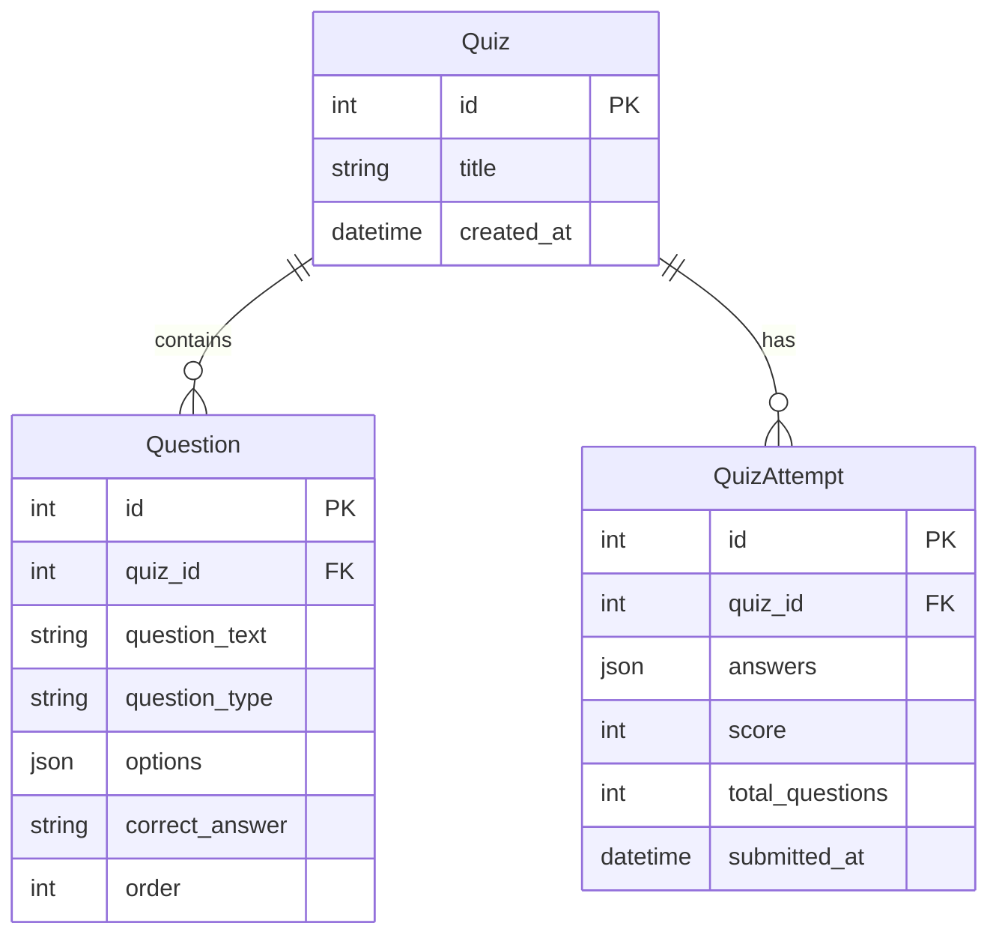

# Design Document

## Overview

The Quiz Management System is a full-stack web application with a Django REST Framework backend and React frontend. The system follows a clean separation of concerns with a RESTful API architecture connecting the frontend and backend.

### Tech Stack
- **Backend:** Django 4.x + Django REST Framework
- **Frontend:** React 18 + Tailwind CSS + Material UI
- **Database:** SQLite (development-friendly, no setup required)
- **API Communication:** Axios for HTTP requests

---

## Architecture

```
┌─────────────────────────────────────────────────────────────────┐
│                         Frontend (React)                        │
│  ┌─────────────────┐    ┌─────────────────┐    ┌─────────────┐ │
│  │   Admin Page    │    │  Quiz Page      │    │  Results    │ │
│  │  (Create Quiz)  │    │  (Take Quiz)    │    │  Display    │ │
│  └────────┬────────┘    └────────┬────────┘    └──────┬──────┘ │
│           │                      │                     │        │
│           └──────────────────────┼─────────────────────┘        │
│                                  │                              │
│                    ┌─────────────▼─────────────┐                │
│                    │      API Service Layer    │                │
│                    │         (Axios)           │                │
│                    └─────────────┬─────────────┘                │
└──────────────────────────────────┼──────────────────────────────┘
                                   │ HTTP/REST
┌──────────────────────────────────┼──────────────────────────────┐
│                         Backend (Django)                        │
│                    ┌─────────────▼─────────────┐                │
│                    │     Django REST Framework │                │
│                    │         API Views         │                │
│                    └─────────────┬─────────────┘                │
│                                  │                              │
│                    ┌─────────────▼─────────────┐                │
│                    │       Serializers         │                │
│                    └─────────────┬─────────────┘                │
│                                  │                              │
│                    ┌─────────────▼─────────────┐                │
│                    │         Models            │                │
│                    │  (Quiz, Question, Attempt)│                │
│                    └─────────────┬─────────────┘                │
└──────────────────────────────────┼──────────────────────────────┘
                                   │
                    ┌──────────────▼──────────────┐
                    │      SQLite Database        │
                    └─────────────────────────────┘
```

---

## Components and Interfaces

### Backend Components

#### 1. Models (`Backend/quiz/models.py`)

| Model | Purpose |
|-------|---------|
| `Quiz` | Stores quiz metadata (title, created_at) |
| `Question` | Stores question data with FK to Quiz |
| `QuizAttempt` | Stores submission results |

#### 2. Serializers (`Backend/quiz/serializers.py`)

| Serializer | Purpose |
|------------|---------|
| `QuestionSerializer` | Serialize/deserialize Question model |
| `QuizSerializer` | Serialize Quiz with nested questions |
| `QuizCreateSerializer` | Handle quiz creation with nested questions |
| `AnswerSubmissionSerializer` | Validate answer submissions |
| `QuizResultSerializer` | Format quiz results response |

#### 3. Views (`Backend/quiz/views.py`)

| View | Endpoint | Method | Purpose |
|------|----------|--------|---------|
| `QuizCreateView` | `/api/quizzes/` | POST | Create new quiz |
| `QuizDetailView` | `/api/quizzes/{id}/` | GET | Retrieve quiz for taking |
| `QuizSubmitView` | `/api/quizzes/{id}/submit/` | POST | Submit answers, get results |

### Frontend Components

#### 1. Pages

| Component | Route | Purpose |
|-----------|-------|---------|
| `AdminPage` | `/admin` | Quiz creation form |
| `QuizPage` | `/quiz/:id` | Take quiz interface |

#### 2. Shared Components

| Component | Purpose |
|-----------|---------|
| `QuestionForm` | Reusable question input for admin |
| `QuestionDisplay` | Display question for quiz taker |
| `ResultsDisplay` | Show quiz results after submission |
| `LoadingSpinner` | Loading state indicator |
| `ErrorMessage` | Error display component |

#### 3. Services

| Service | Purpose |
|---------|---------|
| `api.js` | Axios instance with base URL config |
| `quizService.js` | Quiz-related API calls |

---

## Data Models

### Database Schema



### Model Definitions

#### Quiz Model
```python
class Quiz(models.Model):
    title = models.CharField(max_length=255)
    created_at = models.DateTimeField(auto_now_add=True)
```

#### Question Model
```python
class Question(models.Model):
    QUESTION_TYPES = [
        ('mcq', 'Multiple Choice'),
        ('tf', 'True/False'),
    ]
    
    quiz = models.ForeignKey(Quiz, related_name='questions', on_delete=models.CASCADE)
    question_text = models.TextField()
    question_type = models.CharField(max_length=10, choices=QUESTION_TYPES)
    options = models.JSONField(default=list)  # For MCQ: ["Option A", "Option B", ...]
    correct_answer = models.CharField(max_length=255)
    order = models.PositiveIntegerField(default=0)
```

#### QuizAttempt Model
```python
class QuizAttempt(models.Model):
    quiz = models.ForeignKey(Quiz, related_name='attempts', on_delete=models.CASCADE)
    answers = models.JSONField(default=dict)  # {question_id: user_answer}
    score = models.PositiveIntegerField()
    total_questions = models.PositiveIntegerField()
    submitted_at = models.DateTimeField(auto_now_add=True)
```

---

## API Specifications

### 1. Create Quiz
```
POST /api/quizzes/
```

**Request Body:**
```json
{
  "title": "Sample Quiz",
  "questions": [
    {
      "question_text": "What is 2 + 2?",
      "question_type": "mcq",
      "options": ["3", "4", "5", "6"],
      "correct_answer": "4"
    },
    {
      "question_text": "The sky is blue.",
      "question_type": "tf",
      "options": ["True", "False"],
      "correct_answer": "True"
    }
  ]
}
```

**Response (201 Created):**
```json
{
  "id": 1,
  "title": "Sample Quiz",
  "created_at": "2026-01-15T10:00:00Z",
  "questions": [...]
}
```

### 2. Get Quiz
```
GET /api/quizzes/{id}/
```

**Response (200 OK):**
```json
{
  "id": 1,
  "title": "Sample Quiz",
  "questions": [
    {
      "id": 1,
      "question_text": "What is 2 + 2?",
      "question_type": "mcq",
      "options": ["3", "4", "5", "6"],
      "order": 0
    }
  ]
}
```
*Note: `correct_answer` is NOT included in GET response*

### 3. Submit Quiz
```
POST /api/quizzes/{id}/submit/
```

**Request Body:**
```json
{
  "answers": {
    "1": "4",
    "2": "True"
  }
}
```

**Response (200 OK):**
```json
{
  "score": 2,
  "total_questions": 2,
  "percentage": 100,
  "results": [
    {
      "question_id": 1,
      "question_text": "What is 2 + 2?",
      "user_answer": "4",
      "correct_answer": "4",
      "is_correct": true
    },
    {
      "question_id": 2,
      "question_text": "The sky is blue.",
      "user_answer": "True",
      "correct_answer": "True",
      "is_correct": true
    }
  ]
}
```

---

## Error Handling

### Backend Error Responses

| Status Code | Scenario | Response Format |
|-------------|----------|-----------------|
| 400 | Validation error | `{"field": ["error message"]}` |
| 404 | Quiz not found | `{"detail": "Not found."}` |
| 500 | Server error | `{"detail": "Internal server error"}` |

### Frontend Error Handling

1. **API Errors:** Catch in service layer, display user-friendly message
2. **Network Errors:** Show "Connection error" message with retry option
3. **Validation Errors:** Display inline field errors on forms

---

## Testing Strategy

### Backend Testing

1. **Model Tests:**
   - Quiz creation with valid data
   - Question creation with different types
   - QuizAttempt score calculation

2. **API Tests:**
   - POST /api/quizzes/ - valid and invalid payloads
   - GET /api/quizzes/{id}/ - existing and non-existing quiz
   - POST /api/quizzes/{id}/submit/ - scoring accuracy

### Frontend Testing

1. **Component Tests:**
   - Form validation on AdminPage
   - Question rendering on QuizPage
   - Results display accuracy

2. **Integration Tests:**
   - Full quiz creation flow
   - Full quiz taking flow

### Manual Testing Checklist

- [ ] Create quiz with MCQ questions
- [ ] Create quiz with True/False questions
- [ ] Create quiz with mixed question types
- [ ] Take quiz and submit all answers
- [ ] Take quiz and submit partial answers
- [ ] View results with correct/incorrect indicators
- [ ] Test invalid quiz ID handling
- [ ] Test form validation errors

---

## Project Structure

```
quiz_system/
├── Backend/
│   ├── manage.py
│   ├── requirements.txt
│   ├── quiz_project/
│   │   ├── __init__.py
│   │   ├── settings.py
│   │   ├── urls.py
│   │   └── wsgi.py
│   └── quiz/
│       ├── __init__.py
│       ├── models.py
│       ├── serializers.py
│       ├── views.py
│       ├── urls.py
│       └── admin.py
├── Frontend/
│   ├── package.json
│   ├── tailwind.config.js
│   ├── public/
│   └── src/
│       ├── App.jsx
│       ├── index.js
│       ├── components/
│       │   ├── QuestionForm.jsx
│       │   ├── QuestionDisplay.jsx
│       │   ├── ResultsDisplay.jsx
│       │   └── common/
│       ├── pages/
│       │   ├── AdminPage.jsx
│       │   └── QuizPage.jsx
│       └── services/
│           ├── api.js
│           └── quizService.js
├── PLAN.md
└── README.md
```
